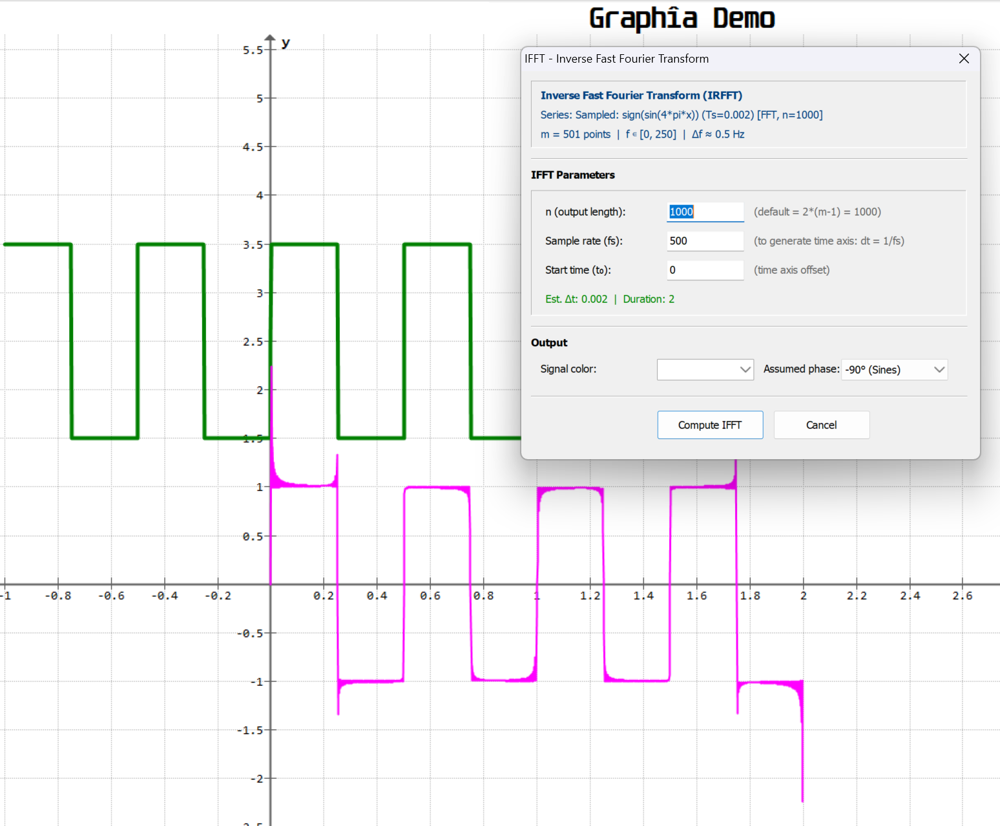
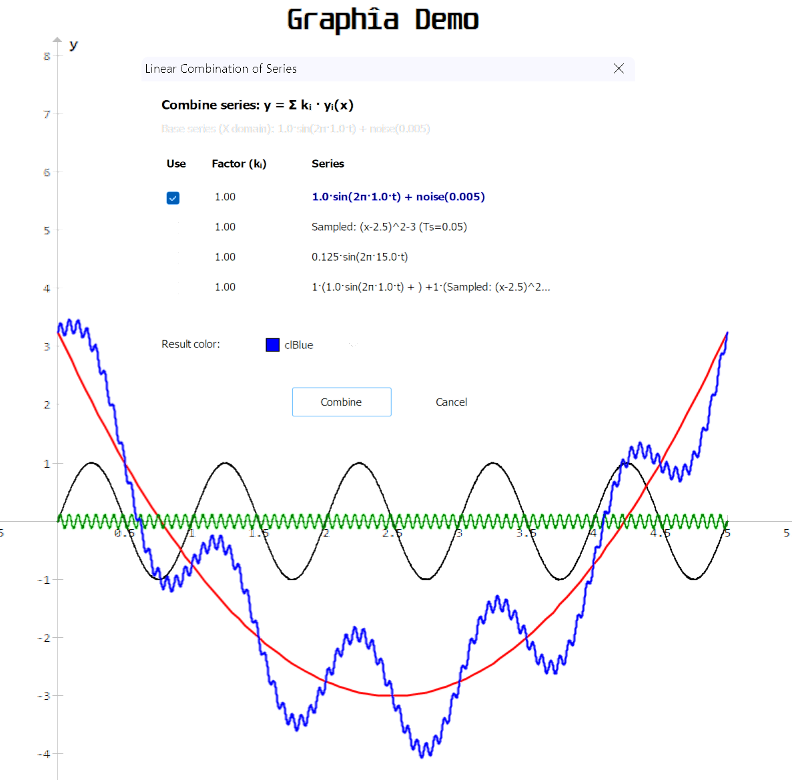
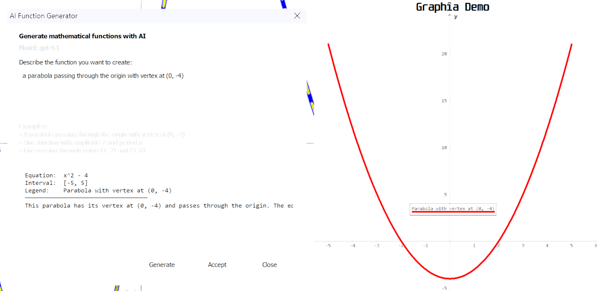
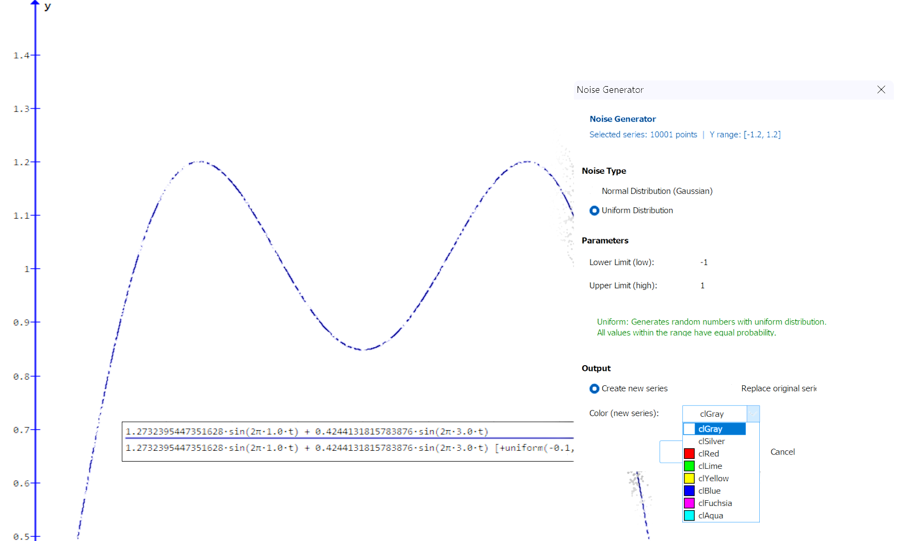
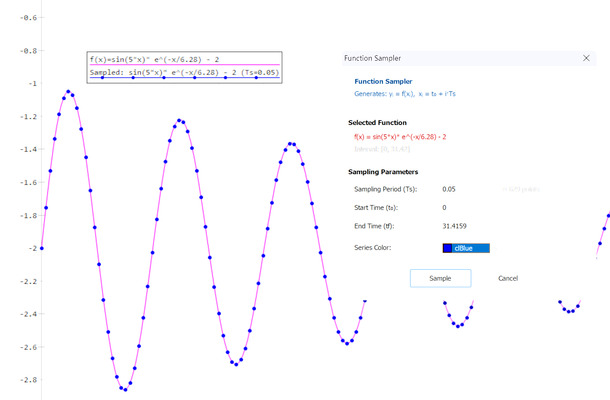

<div align="center">
    <h2 style="color: #FFD700; letter-spacing: 0.2em;">Graph Plugin System for Signal Processing</h2>
</div>
<br/>

<div align="center">
    
    <br>
    <br>
</div>


A comprehensive collection of Python plugins designed for the [Graph](https://www.padowan.dk/) plotting application. This system extends the functionality of Graph by adding advanced signal analysis, filtering, data importing/exporting, signal morphing, visualization tools, and waveform generation capabilities.

---

## Table of Contents

- [Installation](#installation)
- [1. Analysis](#1-analysis)
  - [FFT - Fast Fourier Transform](#fft---fast-fourier-transform)
  - [IFFT - Inverse Fast Fourier Transform](#ifft---inverse-fast-fourier-transform)
- [2. Smoothing](#2-smoothing)
  - [Gaussian Filter](#gaussian-filter)
  - [Selective Median Filter](#selective-median-filter)
- [3. Filtering](#3-filtering)
  - [FIR Filter](#fir-filter)
  - [Convolution](#convolution)
- [4. Importing](#4-importing)
  - [Advanced CSV Importer](#advanced-csv-importer)
  - [Profile Manager](#profile-manager)
- [5. Exporting](#5-exporting)
  - [CSV Exporter](#csv-exporter)
- [6. Morphing](#6-morphing)
  - [Morph - Transform Series](#morph---transform-series)
  - [Resample](#resample)
  - [Signal Info](#signal-info)
  - [Apply Function](#apply-function)
  - [Linear Combination](#linear-combination)
  - [Crop/Cut](#cropcut)
  - [Fill Segment](#fill-segment)
  - [Spectral Interpolation](#spectral-interpolation)
- [7. Visualization](#7-visualization)
  - [Draw Visible Rect](#draw-visible-rect)
- [8. Waveform Generation](#8-waveform-generation)
  - [Composite Signal Generator](#composite-signal-generator)
  - [AI Function Generator](#ai-function-generator)
  - [Gauss Pulse Generator](#gauss-pulse-generator)
  - [Square Wave Generator](#square-wave-generator)
  - [Noise Generator](#noise-generator)
  - [Function Sampler](#function-sampler)
- [9. Utilities](#9-utilities)
  - [Plugin Manager](#plugin-manager)
  - [Show Console](#show-console)
- [Author](#author)
- [License](#license)

---

## Installation

### Quick Install (Recommended)

1. **Download** the latest release `.zip` from [GitHub Releases](https://github.com/marzzelo/graph-plugins/releases).
2. **Extract** the contents into Graph's `Plugins` folder:
   - `C:\Program Files (x86)\Graph\Plugins` (All users, requires Admin)
   - or `C:\Users\<YourUsername>\AppData\Local\Graph\Plugins` (Current user only)
3. **Run the installer** to set up the Python environment:
   - Double-click `install.bat` (Command Prompt)
   - Or right-click `install.ps1` and select "Run with PowerShell"
4. **Restart Graph**. The plugins will be automatically loaded.

> **Note**: The installer creates a `.packages` folder with all required Python packages. This requires an internet connection.

### Manual Installation

Choose one of the following plugin locations:

1.  **All Users** (Requires Administrator privileges):
    *   `C:\Program Files (x86)\Graph\Plugins`
2.  **Current User Only**:
    *   `C:\Users\<YourUsername>\AppData\Local\Graph\Plugins`

Then create the packages folder manually (see Development Setup below).

---

# 1. Analysis

## FFT - Fast Fourier Transform

Computes the amplitude spectrum of the selected point series using the Fast Fourier Transform algorithm. Uses `scipy.fft.rfft` optimized for real-valued signals.

**Parameters:**
*   **Window Function**: Apply a window function before FFT (Hann, Hamming, Blackman, etc.) to reduce spectral leakage.
*   **Zero Padding**: Extend signal to the next power of 2 for improved frequency resolution.
*   **Output Type**: Choose between amplitude spectrum, power spectrum, or power spectral density.
*   **Normalization**: Select appropriate normalization for the output.

**Output:**
The plugin generates a new point series representing the frequency domain, with frequency (Hz) on the X-axis and amplitude/power on the Y-axis.

---

## IFFT - Inverse Fast Fourier Transform

Reconstructs a time-domain signal from its frequency-domain representation using the inverse FFT. Uses `scipy.fft.irfft` for efficient computation.

**Parameters:**
*   **Input Series**: The frequency-domain spectrum (typically output from FFT).
*   **Sample Rate**: The original sampling rate for correct time scaling.
*   **Output Points**: Number of points in the reconstructed signal.

**Usage:**
This plugin is typically used after FFT processing, such as spectral filtering or modification, to convert the signal back to the time domain.



*Figure: Time-domain signal reconstructed from frequency spectrum using IFFT*

---

# 2. Smoothing

## Gaussian Filter

Applies a Gaussian smoothing filter to the selected point series. This is useful for reducing noise in experimental data while preserving the general trend.

**Parameters:**
*   **Sigma**: The standard deviation of the Gaussian kernel in units of the X-axis. Controls the "width" of the smoothing. Suggested value: approximately 1% of the X range.
*   **Mode**: Determines how the signal is extended at the boundaries (e.g., `nearest`, `reflect`, `mirror`).
*   **Truncate**: Limits the size of the kernel to a number of standard deviations (default is 4.0).
*   **Result**: Choose to create a **New Series** (preserving the original) or **Replace** the existing one.


*Figure: Gaussian Filter applied to a noisy signal*

---

## Selective Median Filter

Applies a median filter to remove "salt and pepper" noise or outliers without blurring sharp edges as much as a linear filter.

**Parameters:**
*   **Window Size**: The number of points in the sliding window (must be an odd integer, e.g., 3, 5, 7).
*   **Threshold**: The deviation threshold. If the difference between a point and the median of its neighbors exceeds this value, the point is replaced by the median.
*   **Result**: Create a new series or replace the original.


*Figure: Selective Median Filter removing spikes from a signal*

---

# 3. Filtering

## FIR Filter

Designs and applies Finite Impulse Response (FIR) bandpass filters using `scipy.signal.firwin` for kernel design and `scipy.signal.filtfilt` for zero-phase filtering.

**Parameters:**
*   **Filter Type**: Lowpass, Highpass, Bandpass, or Bandstop.
*   **Cutoff Frequencies**: Define the frequency boundaries for the filter.
*   **Filter Order**: Number of filter coefficients (higher order = sharper cutoff but more computational cost).
*   **Window Function**: Window used for FIR design (Hamming, Hann, Blackman, etc.).
*   **Sample Rate**: Automatically detected from the input series.

**Features:**
*   Zero-phase filtering using `filtfilt` to avoid phase distortion.
*   Visual preview of the filter frequency response.
*   Automatic sample rate detection from series data.

---

## Convolution

Convolves the selected point series with a kernel, which can be another point series or a sampled mathematical function (TStdFunc).

**Parameters:**
*   **Signal**: The currently selected point series.
*   **Kernel**: Choose from available point series or mathematical functions in the graph.
*   **Mode**: Convolution mode - `full`, `same`, or `valid`.
*   **Normalization**: Option to normalize the kernel before convolution.

**Applications:**
*   Signal smoothing with custom kernels
*   Matched filtering for signal detection
*   Custom filter implementation
*   Cross-correlation analysis

---

# 4. Importing

## Advanced CSV Importer

A flexible tool for importing data from CSV or text files, with automatic column detection and type parsing.

**Features and Parameters:**
*   **File Preview**: Shows the selected filename and data preview.
*   **Header Detection**: Option to indicate if the first row contains column names.
*   **Separator**: Auto-detects or allows manual selection of delimiters (Comma, Semicolon, Tab, Pipe).
*   **X Column**: Select which column represents the X-axis (Time/Index). Other numeric columns become Y-series.
*   **Column Selection**: Checkboxes to include/exclude specific columns from import.
*   **Date/Time Parsing**: Automatically converts DateTime columns into relative seconds (t=0 at first sample).
*   **Row Range**: Specify start row and maximum number of rows to import.
*   **NaN Handling**: Choose to delete rows with missing values or fill with median of neighbors.


*Figure: Advanced CSV Import Configuration Dialog*

---

## Profile Manager

Saves and loads axis and graph configuration profiles. Useful for quickly switching between different graph configurations.

**Features:**
*   **Save Profile**: Saves current axis limits, labels, fonts, and graph settings to a JSON file.
*   **Load Profile**: Restores a previously saved configuration.
*   **Delete Profile**: Removes saved profiles.
*   **Profile List**: Browse and manage all saved profiles.


*Figure: Profile Manager Dialog*

---

# 5. Exporting

## CSV Exporter

Exports visible point series to CSV format with flexible configuration options. The selected series defines the sampling period and limits, while other series are automatically resampled using cubic interpolation to match.

**Features:**
*   **Base Series**: The currently selected series defines the X domain (time/sampling) and limits for all exported data.
*   **Automatic Resampling**: Other visible series are resampled using CubicSpline interpolation to match the base series' X values.
*   **Column Configuration**:
    *   **Include/Exclude**: Choose which columns to include in the export.
    *   **Column Names**: Customize header names for each column.
    *   **Decimal Places**: Configure precision for each column individually.
    *   **Column Order**: Reorder columns as needed.
*   **Separator Options**: Choose from comma, semicolon, tab, or pipe separators.
*   **Sample Index**: Optionally include a Sample# column as the first column.

**Usage:**
1.  Select the point series you want to use as the **base** (defines sampling and limits).
2.  Make sure all series you want to export are **visible**.
3.  Open the dialog from `Plugins > Graphia > Exporting > CSV Exporter...`
4.  Configure columns (names, decimals, order, include/exclude).
5.  Select the output file path and separator.
6.  Click **Export** to generate the CSV file.

**Output Format:**
```csv
time,Base Series,Other Series 1,Other Series 2
0.000000,1.234567,2.345678,3.456789
0.001000,1.234890,2.345901,3.457012
...
```


*Figure: CSV Exporter dialog with column configuration*

---

# 6. Morphing

## Morph - Transform Series

Transforms a point series to new X and Y limits. Useful for scaling and shifting data to match different coordinate systems.

**Parameters:**
*   **Current Limits**: Displays the current X and Y range of the selected series.
*   **New X Limits**: Target minimum and maximum X values.
*   **New Y Limits**: Target minimum and maximum Y values.
*   **Result**: Choose to create a **New Series** or **Replace** the original.


*Figure: Morph dialog for transforming series limits*

---

## Resample

Resamples a point series using various interpolation methods. Useful for changing the sampling rate or regularizing irregularly sampled data.

**Parameters:**
*   **Resampling Mode**: Choose between new sampling period, new sampling frequency, new number of points, or resample by factor.
*   **Interpolation Method**: Choose from Linear (`np.interp`), `CubicSpline`, `PchipInterpolator`, or `Akima1DInterpolator`.
*   **Downsampling Filter**: When reducing sample rate, optionally apply anti-aliasing filter using `scipy.signal.decimate`.
*   **Result**: Create a new series or replace the original.


*Figure: Resample Dialog showing interpolation options*

---

## Signal Info

Calculates and displays statistical information about the selected point series, with optional visualization of statistics as horizontal lines on the graph.

**Statistics Displayed:**
*   **Y Range**: Minimum and Maximum Y values.
*   **Mean**: Average of Y values.
*   **Median**: Middle value of Y data.
*   **Standard Deviation**: Measure of data dispersion.
*   **Add Info Lines**: Optionally adds horizontal lines for Ymin, Ymax, Mean, Median, and plus/minus 1 standard deviation.


*Figure: Signal Info dialog with statistical analysis*

---

## Apply Function

Applies a custom mathematical function `f(y)` to each Y value of the selected point series, generating a new transformed series.

**Parameters:**
*   **Selected Series**: Displays the name and point count of the currently selected series.
*   **Function f(y)**: Enter a mathematical expression using `y` as the variable (e.g., `y^2`, `sqrt(y)`, `ln(y)`).
*   **Output Mode**: Choose to create a **New Series** or **Replace** the original.
*   **Series Color**: Select the color for the new series (when creating a new one).

**Examples:**
*   `y^2` - Square each Y value
*   `sqrt(y)` - Square root transformation
*   `abs(y)` - Absolute value
*   `ln(y)` - Natural logarithm
*   `10*y + 5` - Linear transformation
*   `sin(y)` - Sine of Y values
*   `e^(-y)` - Exponential decay


*Figure: Apply Function dialog for transforming Y values*

---

## Linear Combination

Combines multiple point series linearly using the formula `y = Sum(ki * yi(x))`, where each series is multiplied by a user-defined factor.

**Parameters:**
*   **Base Series**: The selected series defines the X domain (all other series are interpolated to these X values).
*   **Series List**: Shows all visible point series with:
    *   **Checkbox**: Select which series to include in the combination.
    *   **Factor (ki)**: The multiplication factor for each series (default: 1.00).
    *   **Legend**: Series name (limited to 50 characters).
*   **Interpolation**: Uses CubicSpline with extrapolation for non-base series.
*   **Result Color**: Choose the color for the resulting combined series.

**Example:**
```
[x]  [ 3.50 ]   sin(x)
[ ]  [ 1.00 ]   x + 3
[x]  [-1.54 ]   x^2 + x
```
Result: `y = 3.5*sin(x) - 1.54*(x^2 + x)`



*Figure: Linear Combination dialog for combining multiple series*

---

## Crop/Cut

Crops or cuts data from a point series based on a selected rectangular area. Allows precise control over which portions of data to keep or remove.

**Parameters:**
*   **X Range**: Define the X-axis boundaries for the operation.
*   **Y Range**: Define the Y-axis boundaries for the operation.
*   **Operation Mode**:
    *   **Crop**: Keep only points within the specified rectangle.
    *   **Cut**: Remove points within the rectangle, keeping the rest.
    *   **Draw Rectangle**: Create a visual rectangle outline on the graph.
*   **Result**: Create a new series or modify the original.

**Features:**
*   Default values match the current visible window.
*   Preview of affected point count before applying.
*   Option to draw rectangles for visual markup.

---

## Fill Segment

Fills a segment of the selected point series with constant values or values from another series.

**Parameters:**
*   **Segment Range**: Define Start X and End X for the segment to fill (defaults to visible window).
*   **Fill Mode**:
    *   **Constant Value**: Fill with a user-specified constant.
    *   **Values from Another Series**: Select a source series from a dropdown list.
*   **Interpolation**: If the source series has a different sampling rate, linear interpolation is automatically applied.
*   **Output Mode**: Replace points in the original series or create a new series.
*   **Series Color**: Select color for new series (when applicable).

**Features:**
*   Points outside the source series range keep their original values.
*   Warning message if some points could not be replaced.
*   Real-time display of points affected.

---

## Spectral Interpolation

Fills gaps in signals using FFT-based spectral interpolation. This advanced technique reconstructs missing data by analyzing the frequency content of the surrounding signal.

**Parameters:**
*   **Gap Boundaries**: Define the X range of the gap to fill (Xa to Xb).
*   **Analysis Window**: Number of points before and after the gap to analyze.
*   **Interpolation Mode**:
    *   **Average (pre + post)**: Use frequency content from both sides.
    *   **Pre-gap only**: Use only data before the gap.
    *   **Post-gap only**: Use only data after the gap.
    *   **Weighted average**: Weight by proximity to gap edges.

**Algorithm:**
1. Extract segments before and after the gap.
2. Compute FFT of each segment.
3. Combine spectral information based on selected mode.
4. Reconstruct gap using inverse FFT with phase continuity.


*Figure: Spectral Interpolation filling a gap in the signal*


*Figure: Theoretical basis of spectral interpolation*

---

# 7. Visualization

## Draw Visible Rect

Draws a rectangle that matches the current visible axis area. Useful for marking or highlighting the current view boundaries.

**Features:**
*   Automatically reads current X and Y axis limits.
*   Creates a dashed rectangle as a point series.
*   Customizable line style and color.


*Figure: Visible rectangle drawn on the graph area*

---

# 8. Waveform Generation

## Composite Signal Generator

Generates a composite signal formed by the sum of multiple sinusoidal waves or arbitrary mathematical functions, with optional noise.

**Parameters:**
*   **Generation Mode**: Choose between sinusoidal components or arbitrary function.
*   **Sinusoidal Mode**: Configure up to 6 components, each with:
    *   **Frequency (Hz)**
    *   **Amplitude (V)**
    *   **Phase (rad)**
*   **Arbitrary Function Mode**: Enter a mathematical expression using `t` as the time variable.
*   **Sampling**:
    *   **Fs**: Sampling Frequency (Hz).
    *   **T0 / Tf**: Start and End time (seconds).
*   **Noise**: Amplitude of Gaussian noise added to the signal.
*   **Appearance**: Select **Color** and **Thickness** for the generated plot.


*Figure: Composite Signal Generator Dialog*

---

## AI Function Generator

Generates mathematical functions using **OpenAI's GPT models** with natural language prompts. Describe the function you want in plain English or Spanish, and the AI will generate the appropriate equation, interval, and legend for Graph. Supports both **standard** (y = f(x)) and **parametric** (x(t), y(t)) functions, chosen automatically by the model.

**Features:**
*   **Natural Language Input**: Describe your function in everyday language (e.g., "A parabola that passes through the origin", "A circle of radius 5").
*   **Automatic Function Type**: The AI decides whether to generate a standard (y = f(x)) or parametric (x(t), y(t)) function based on your description.
*   **Model Selection**: Choose from multiple OpenAI models (GPT-4, GPT-5, o3, etc.) directly in the plugin dialog.
*   **Reasoning Level**: Select the reasoning effort (low, medium, high) for more accurate or creative results.
*   **Verbosity**: Control the level of explanation detail (low, medium, high).
*   **Structured Output**: Uses OpenAI's structured outputs with Pydantic validation to ensure correct Graph syntax.
*   **Automatic Interval**: The AI suggests an appropriate interval for x or t based on the function type.
*   **Session API Key**: If no API key is configured in `.env`, the plugin prompts for manual entry. The key is stored only for the current session.

**Configuration (`.env` file in Plugins folder):**
```env
OPENAI_API_KEY=sk-your-api-key-here
OPENAI_MODEL=gpt-5.1
```

**Usage:**
1.  Open the dialog from `Plugins > Graphia > AWF Generators > AI Function Generator...`
2.  Enter a description of the function you want to create.
3.  Select the desired model, reasoning level, and verbosity.
4.  Click **Generate** to send the request to OpenAI.
5.  Review the generated equation(s), interval, and explanation.
6.  Click **Accept** to add the function to Graph.

**Function Types:**
*   **Standard**: y = f(x) (e.g., lines, parabolas, sine waves)
*   **Parametric**: x(t), y(t) (e.g., circles, ellipses, spirals, Lissajous curves)

**Example Prompts:**
*   "A parabola that passes through the origin"
*   "Sine function between 0 and 2 pi"
*   "A circle of radius 5"
*   "Draw an ellipse with horizontal axis 6 and vertical axis 3"
*   "A spiral"
*   "Lissajous curve"
*   "A heart shape"


*Figure: Standard function generated from natural language*


*Figure: Parametric function generated from natural language*



*Figure: AI Function Generator dialog with natural language input*


*Figure: Generated function displayed in Graph*

---

## Gauss Pulse Generator

Generates Gaussian modulated sinusoid pulses using `scipy.signal.gausspulse`. Useful for creating test signals for radar, communications, and ultrasonic applications.

**Parameters:**
*   **Center Frequency (fc)**: The center frequency of the modulated sinusoid (Hz).
*   **Bandwidth (bw)**: Fractional bandwidth of the pulse (relative to center frequency).
*   **Bandwidth Reference (bwr)**: Reference level for bandwidth specification (dB, typically -6 dB).
*   **Time Range**: Start and end times for the generated pulse.
*   **Sampling Rate**: Number of samples per second.
*   **Envelope Output**: Option to also generate the pulse envelope.

**Formula:**
The Gaussian pulse is defined as:
```
y(t) = exp(-a * t^2) * cos(2 * pi * fc * t)
```
where `a` is derived from the bandwidth parameters.

---

## Square Wave Generator

Generates square wave signals with variable duty cycle using `scipy.signal.square`. The duty cycle can be constant or modulated by another series or function.

**Parameters:**
*   **Frequency (Hz)**: Fundamental frequency of the square wave.
*   **Amplitude**: Peak amplitude of the wave.
*   **Duty Cycle**: Fraction of the period at high level (0 to 1).
    *   **Constant**: Fixed duty cycle value.
    *   **From Series**: Modulate duty cycle using a point series.
    *   **From Function**: Modulate duty cycle using a mathematical function.
*   **Time Range**: Start and end times (T0, Tf).
*   **Sampling Rate (Fs)**: Samples per second.

**Applications:**
*   PWM signal generation
*   Digital signal simulation
*   Testing system response to discontinuous inputs

---

## Noise Generator

Adds random noise to the selected point series. Supports both Normal (Gaussian) and Uniform noise distributions.

**Parameters:**
*   **Noise Type**: Choose between **Normal** (Gaussian distribution) or **Uniform** distribution.
*   **Amplitude / Standard Deviation**: For Uniform noise, specifies the range; for Normal noise, specifies the standard deviation.
*   **Result**: Create a new series or replace the original.


*Figure: Noise Generator Dialog*



*Figure: Signal with uniform noise applied*

---

## Function Sampler

Samples a selected mathematical function (TStdFunc) at discrete points to generate a point series. This is useful for converting continuous functions into discrete data for further processing or analysis.

**Parameters:**
*   **Selected Function**: Displays the equation and interval of the currently selected function.
*   **Sampling Period (Ts)**: The time interval between consecutive samples. Default is 1% of the function's interval range.
*   **Start Time (t0)**: The starting point for sampling (defaults to function's `From` value).
*   **End Time (tf)**: The ending point for sampling (defaults to function's `To` value).
*   **Series Color**: Choose the color for the generated point series.

**Formula:**
The plugin generates points using: `y_i = f(x_i)` where `x_i = t0 + i * Ts`

**Usage:**
1.  Select a function (TStdFunc) in the function panel.
2.  Open the dialog from `Plugins > Graphia > AWF Generators > Function Sampler...`
3.  Adjust the sampling period and time range as needed.
4.  Click **Sample** to generate the point series.



*Figure: Function Sampler dialog and sampled points from a damped oscillation*

---

# 9. Utilities

## Plugin Manager

Allows mounting and unmounting Graph plugins through a graphical interface. Unmounted plugins will not load on the next Graph restart.

**Features:**
*   **Plugin Tree View**: Hierarchical display of all available plugins organized by category.
*   **Mount/Unmount**: Enable or disable plugins without deleting files.
*   **Plugin Information**: View name, version, and description of each plugin.
*   **Status Indicators**: Visual indication of mounted/unmounted state.

**Technical Details:**
*   Unmounting renames `__init__.py` to `__init__.py.disabled`.
*   Changes take effect after restarting Graph.
*   Core plugins and system folders are protected from modification.

---

## Show Console

Toggles the Python interpreter console window using the **F11** hotkey. Allows for advanced debugging and direct script execution within Graph.

**Features:**
*   Direct access to Python interpreter.
*   Execute Python commands interactively.
*   Debug plugins and inspect Graph objects.
*   Access to all loaded modules and the Graph API.

---

## Author

**Ing. Marcelo A. Valdez**

*Electronic Engineer*

*Systems Engineer for Structural Testing and Embedded Software Developer*

**Location**: Cordoba, Argentina

**Email**: zedlavolecram@gmail.com

**Workplace**: Laboratorio de Adquisicion de Datos - Ensayos Estructurales - FAdeA S.A. (Fabrica Argentina de Aviones)

---
*Developed for the enhancement of data acquisition and processing workflows.*

## License

This project is licensed under the **MIT License**.

```text
Permission is hereby granted, free of charge, to any person obtaining a copy
of this software and associated documentation files (the "Software"), to deal
in the Software without restriction, including without limitation the rights
to use, copy, modify, merge, publish, distribute, sublicense, and/or sell
copies of the Software, and to permit persons to whom the Software is
furnished to do so, subject to the following conditions:

The above copyright notice and this permission notice shall be included in all
copies or substantial portions of the Software.
```
