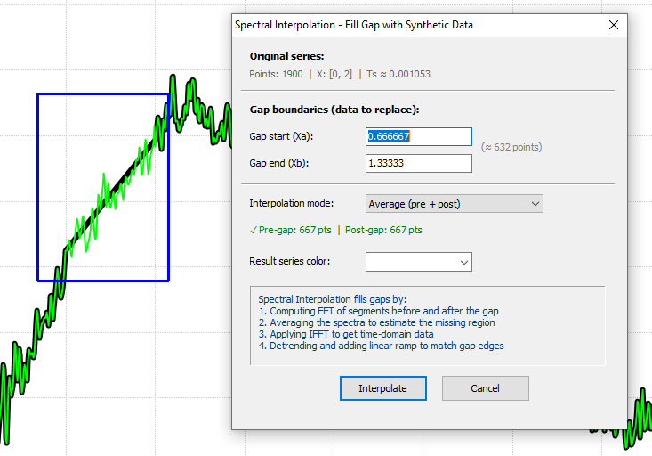

## Interpolación Espectral

La interpolación espectral es una técnica usada en análisis numérico y procesamiento de señales para estimar valores de una función en puntos donde no se midió explícitamente, usando sus valores conocidos y su contenido en frecuencia.

Rellena huecos (gaps) en señales usando interpolación espectral basada en FFT. Esta técnica reconstruye datos faltantes analizando el contenido en frecuencia de la señal alrededor del hueco.

# Interpolación Espectral: Reconstruyendo Señales con Magia Frecuencial

Cuando una señal de audio, una medición de un sensor o cualquier serie de datos tiene un hueco, nuestro primer instinto podría ser simplemente "conectar los puntos" con una línea recta. Pero, ¿qué pasa si la señal es una canción o una vibración compleja? Una línea recta sonaría o se vería artificial.

Es como intentar adivinar una palabra faltante en una frase rota; no basta con poner letras al azar: necesitas entender el contexto y el ritmo de la conversación. La interpolación espectral es un método mucho más inteligente que funciona "escuchando" el ritmo y la composición de la señal para rellenar el hueco de una manera que tenga perfecto sentido.

---

## 1. El Problema: Un Vacío en la Información

En el mundo del procesamiento de señales, es común encontrarnos con datos faltantes. Esto puede ocurrir por múltiples razones, como breves fallos en un sensor (conocidos como dropouts) o la pérdida de paquetes de datos durante una transmisión. El verdadero desafío no es solo rellenar ese vacío, sino hacerlo de una manera que sea coherente y natural con el resto de la información.

Si simplemente unimos los bordes del hueco, el resultado es poco convincente. La siguiente imagen muestra una señal con datos faltantes en el intervalo aproximado de 7.0 a 7.5 segundos (específicamente entre 7.001 y 7.492 s). La línea roja representa una simple conexión lineal, una solución que ignora por completo la naturaleza oscilatoria y el "ritmo" de la señal original.

<!-- (Figura) Señal con hueco + interpolación lineal (línea roja) -->

Como se puede ver, esta solución es artificial y no respeta el patrón de la señal.

Para solucionar esto de forma eficaz, debemos decidir si trabajar en el dominio del tiempo o en el dominio de la frecuencia. Veamos qué significa cada uno.

---

## 2. Dos Mundos, Dos Soluciones: Tiempo vs. Frecuencia

La forma en que abordamos un hueco en los datos depende fundamentalmente de la "perspectiva" que adoptemos: si miramos la señal como una secuencia de puntos en el tiempo o como una mezcla de frecuencias.

| Aspecto | Dominio del tiempo (ej. interpolación lineal) | Dominio de la frecuencia (interpolación espectral) |
|---|---|---|
| ¿Cómo funciona? | Se limita a "conectar los puntos" entre el final del último dato conocido y el inicio del siguiente. | Analiza el "contenido frecuencial" (componentes periódicos y armónicos) de la señal justo antes y después del hueco para reconstruirlo. |
| Principio | Solo considera la información de los bordes inmediatos del hueco. | Estima el "ADN" de la señal a partir de sus vecinos para sintetizar un nuevo segmento que comparta las mismas características espectrales. |
| Resultado | Produce una reconstrucción simple pero a menudo poco natural, especialmente para señales oscilatorias. | Genera una reconstrucción mucho más fiel, precisa y coherente, ya que la porción rellenada "vibra" en sintonía con el resto de la señal. |

Para señales que tienen patrones repetitivos, como vibraciones, audio u otras oscilaciones, pensar en el dominio de la frecuencia ofrece una reconstrucción inmensamente superior.

Ahora que entendemos la ventaja de 'pensar' en frecuencias, desglosemos el proceso paso a paso de la interpolación espectral.

---

## 3. El Proceso de Interpolación Espectral: Un Recetario en 4 Pasos

La interpolación espectral puede parecer compleja, pero se basa en un proceso lógico y secuencial. Aquí lo descomponemos en cuatro pasos fundamentales.

1. **Paso 1: Extraer la información de los vecinos.** El algoritmo comienza por analizar la señal en las inmediaciones del hueco. Para ello, toma dos segmentos de datos: uno justo antes del vacío (*pre-gap*) y otro justo después (*post-gap*). El tamaño de estos segmentos es un parámetro crucial, ya que define cuánta "historia" se utiliza para predecir el contenido del hueco. Aquí existe un compromiso importante: un segmento más grande "escucha" más historia, lo que mejora la resolución espectral (identifica las frecuencias con más precisión), pero si el carácter de la señal cambia con el tiempo (es no estacionaria), un segmento muy largo podría promediar detalles importantes y ser menos representativo.
2. **Paso 2: Traducir a frecuencia (FFT).** Una vez extraídos los segmentos, se les aplica la Transformada Rápida de Fourier (FFT). Este es el paso donde pasamos del dominio del tiempo al dominio de la frecuencia. La FFT descompone cada segmento en sus frecuencias constituyentes, revelando su "espectro": qué tonos y con qué intensidad están presentes.
3. **Paso 3: Combinar los espectros.** Con los espectros de los segmentos *pre-gap* y *post-gap* en mano, el algoritmo los combina para crear un espectro representativo del hueco. Aunque promediar ambos (*Average (pre + post)*) es la estrategia más común, existen otros modos: usar solo la información anterior (*Pre-gap only*) o posterior (*Post-gap only*) —útil si la señal cambia bruscamente tras el hueco— o incluso un promedio ponderado (*Weighted average*) que da más importancia a los datos más cercanos.
4. **Paso 4: Reconstruir la señal (IFFT).** Finalmente, se utiliza la Transformada de Fourier Inversa (IFFT) para convertir el espectro combinado de vuelta a una señal en el dominio del tiempo. Esto genera un nuevo segmento de datos con las características frecuenciales deseadas. Para asegurar una transición perfecta, este segmento se ajusta en dos fases finales: primero se aplica un *detrending* para corregir cualquier tendencia lineal y luego una rampa para garantizar que se acople suavemente a los bordes del hueco, sin saltos ni discontinuidades.

La teoría suena bien, pero ¿cómo se ve el resultado en la práctica? La evidencia visual es contundente.

---

## 4. La Prueba Visual: Antes y Después

Al aplicar la interpolación espectral, el hueco se rellena con una nueva sección de señal (mostrada en turquesa en la vista general y en fucsia en las vistas de detalle) que fluye de manera natural con el resto. A diferencia de la línea recta, esta reconstrucción imita la forma de onda y el comportamiento oscilatorio de la señal original.

<!-- (Figura) Vista general: señal original + segmento interpolado (turquesa) -->

Si hacemos zoom en la zona reparada, podemos apreciar la continuidad y suavidad de la transición. La señal interpolada se une a la original sin ninguna interrupción abrupta, creando un resultado homogéneo.

<!-- (Figura) Zoom: transición suave entre señal original e interpolada (fucsia) -->

La prueba definitiva de su éxito se encuentra al comparar los espectros. El siguiente gráfico muestra el espectro de la señal original completa (en azul) superpuesto con el de la señal reconstruida (en fucsia).

<!-- (Figura) Comparación de espectros FFT: señal original (azul) vs. reconstruida (fucsia) -->

La conclusión es clara: los dos espectros son prácticamente idénticos. Esto significa que la interpolación espectral no solo rellena el hueco, sino que lo hace preservando las características frecuenciales de la señal original, que es la clave para una reconstrucción creíble.

Sabiendo lo potente que es esta técnica, ¿cuándo deberíamos pensar en utilizarla?

---

## 5. ¿Cuándo Usar la Interpolación Espectral?

Esta técnica es especialmente útil en escenarios específicos donde preservar la naturaleza de la señal es primordial.

- **Reparar ausencias cortas:** Para corregir *dropouts* breves en señales de sensores, datos de telemetría o paquetes de datos perdidos en una transmisión.
- **Rellenar artefactos eliminados:** Cuando se ha eliminado un ruido no deseado (como un pico impulsivo) y se necesita reconstruir el espacio vacío de forma consistente con las frecuencias de la señal circundante.
- **Preparar datos para análisis futuro:** Para generar muestras intermedias que sean plausibles antes de aplicar otros algoritmos, como filtros o un análisis espectral más profundo.
- **Condición ideal:** Funciona de manera óptima en señales muestreadas uniformemente y cuando los huecos son lo suficientemente cortos como para que las características de la señal (su "ritmo" y componentes frecuenciales) no cambien drásticamente entre el inicio y el final del vacío. En términos técnicos, la señal debe ser "localmente estacionaria".

Llegando al final de nuestro recorrido, recapitulemos la idea fundamental.

---

## 6. Conclusión: Más Allá de Conectar los Puntos

La interpolación espectral es una técnica fundamentalmente más robusta que los métodos simples que operan en el dominio del tiempo, especialmente para señales con contenido periódico. Su verdadero poder reside en su capacidad para analizar y reconstruir el "ADN frecuencial" de la señal. En lugar de simplemente trazar una línea para conectar dos puntos, este método sintetiza una porción de señal completamente nueva que "vibra" en perfecta armonía con el resto. El resultado es una reconstrucción más natural, precisa y, en última instancia, mucho más fiel a la realidad.

**Parámetros:**
*   **Límites del hueco**: Definen el rango X del hueco a rellenar (Xa a Xb).
*   **Ventana de análisis**: Cantidad de puntos antes y después del hueco a analizar.
*   **Modo de interpolación**:
    *   **Promedio (pre + post)**: Usa contenido de ambos lados.
    *   **Solo pre-hueco**: Usa solo datos antes del hueco.
    *   **Solo post-hueco**: Usa solo datos después del hueco.
    *   **Promedio ponderado**: Pondera por proximidad a los bordes.

**Algoritmo:**
1. Extraer segmentos antes y después del hueco.
2. Calcular FFT de cada segmento.
3. Combinar la información espectral según el modo seleccionado.
4. Reconstruir el hueco usando IFFT manteniendo continuidad de fase.

*Figura: Infografía del proceso de interpolación espectral*

*Figura: Interpolación espectral rellenando un hueco en la señal*

*Figura: Base teórica de la interpolación espectral*

*Figura: Diálogo de parámetros de interpolación espectral*

*Figura: Vista ampliada del resultado*
